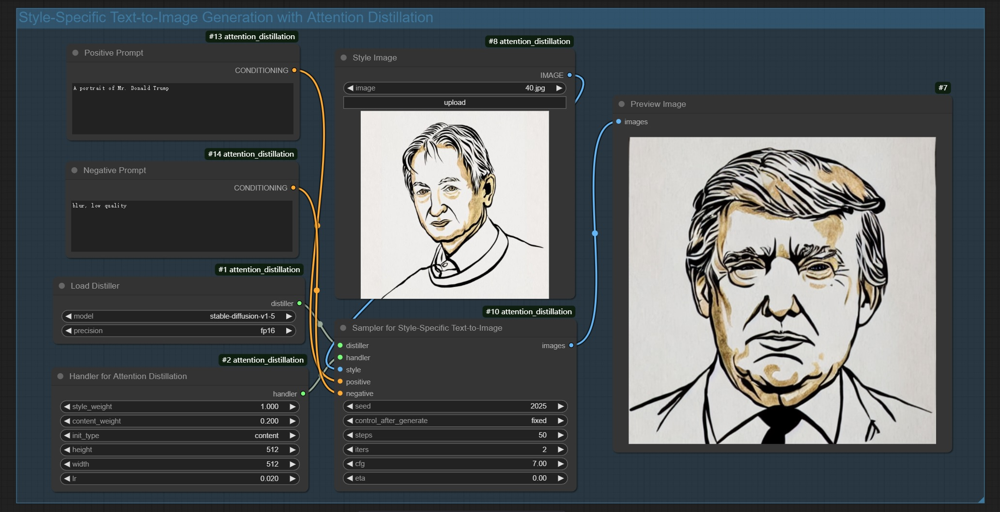
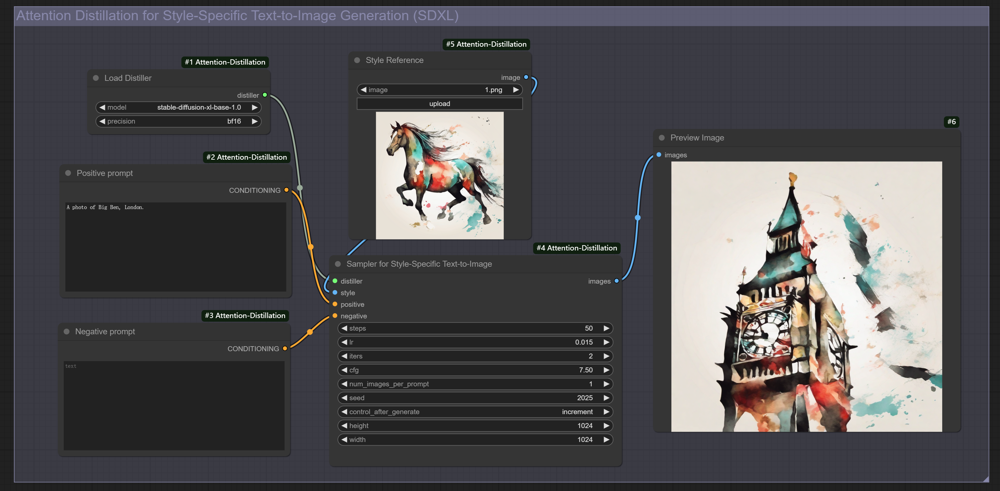
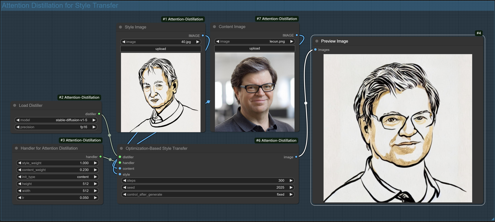

## ComfyUI-Attention-Distillation

Non-native [AttentionDistillation](https://xugao97.github.io/AttentionDistillation/) for ComfyUI.

Official ComfyUI demo for the paper [AttentionDistillation](https://arxiv.org/abs/2502.20235), implemented as an extension of ComfyUI. Note that this extension incorporates AttentionDistillation using `diffusers`.

The official code for AttentionDistillation can be found [here](https://github.com/xugao97/AttentionDistillation).

### 🔥🔥  News
* **2025/03/10**: Workflows for style-specific T2I generation using **SDXL** and **Flux**(beta) have been released.
* **2025/02/27**: We release the ComfyUI implementation of Attention Distillation and two workflows for style transfer and style-specific text-to-image generation using Stable Diffusion 1.5.
* **2025/02/27**: The official code for AttentionDistillation has been released [here](https://github.com/xugao97/AttentionDistillation).

### 🛒 Installation
Download or `git clone` this repository into the `ComfyUI/custom_nodes/` directory, or use the Manager for a streamlined setup.


##### Install manually
  1. `cd custom_nodes`
  2. `git clone ...` 
  3. `cd custom_nodes/ComfyUI-AttentionDistillation`
  4. `pip install -r requirements.txt`
  5. restart ComfyUI

### 📒 How to Use
##### Download T2I diffusion models
This implementation utilizes checkpoints for `diffusers`. Download the required models and place them in the `ComfyUI/models/diffusers` directory:
|Model|Model Name and Link|
|:---:|:---:|
| Stable Diffusion (v1.5, v2.1) | [stable-diffusion-v1-5/stable-diffusion-v1-5](https://huggingface.co/stable-diffusion-v1-5/stable-diffusion-v1-5) <br> [stabilityai/stable-diffusion-2-1](https://huggingface.co/stabilityai/stable-diffusion-2-1) |
| SDXL | [stabilityai/stable-diffusion-xl-base-1.0](https://huggingface.co/stabilityai/stable-diffusion-xl-base-1.0) |
| Flux (dev) | [black-forest-labs/FLUX.1-dev](https://huggingface.co/black-forest-labs/FLUX.1-dev) |


~~*Note: Currently, only Stable Diffusion v1.5 is required.*~~

##### Load the workflow
Workflows for various tasks are available in `ComfyUI/custom_nodes/Comfy-Attention-Distillation/workflows`. Simply load them to get started. Additionally, we've included usage examples in the [Examples](#examples) section for your reference.

### 🔍 Examples

#### Style-specific text-to-image generation
`style_t2i_generation_sd15.json`




`style_t2i_generation_sdxl.json`




`style_t2i_generation_flux.json` (beta)

<!--  -->

#### Style Transfer
`style_transfer_sd15.json`




### 📃 TODOs
- [x] Workflow for style-specific text-to-image generation using SDXL.
- [x] Workflow for style-specific text-to-image generation using Flux.
- [ ] Workflow for texture synthesis.


<!-- ### Citation

If you find [AttentionDistillation](https://github.com/xugao97/AttentionDistillation) useful for your research and applications, please cite using this BibTex:

```
@inproceedings{zhou2025attentiondistillation,
  title = {Attention Distillation: A Unified Approach to Visual Characteristics Transfer},
  author = {Yang Zhou, Xu Gao, Zichong Chen, Hui Huang},
  booktitle = {CVPR},
  year = {2025}
}
``` -->

